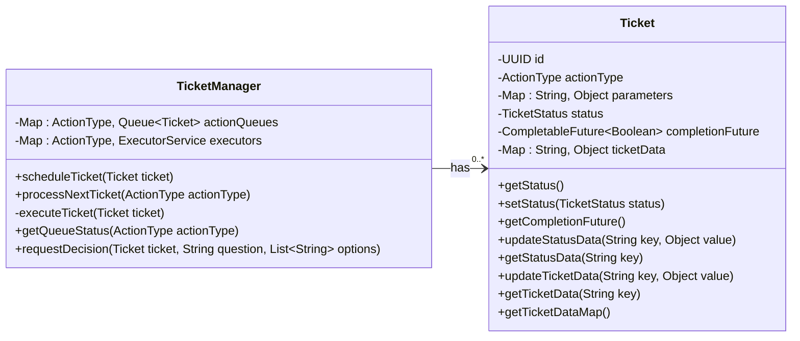
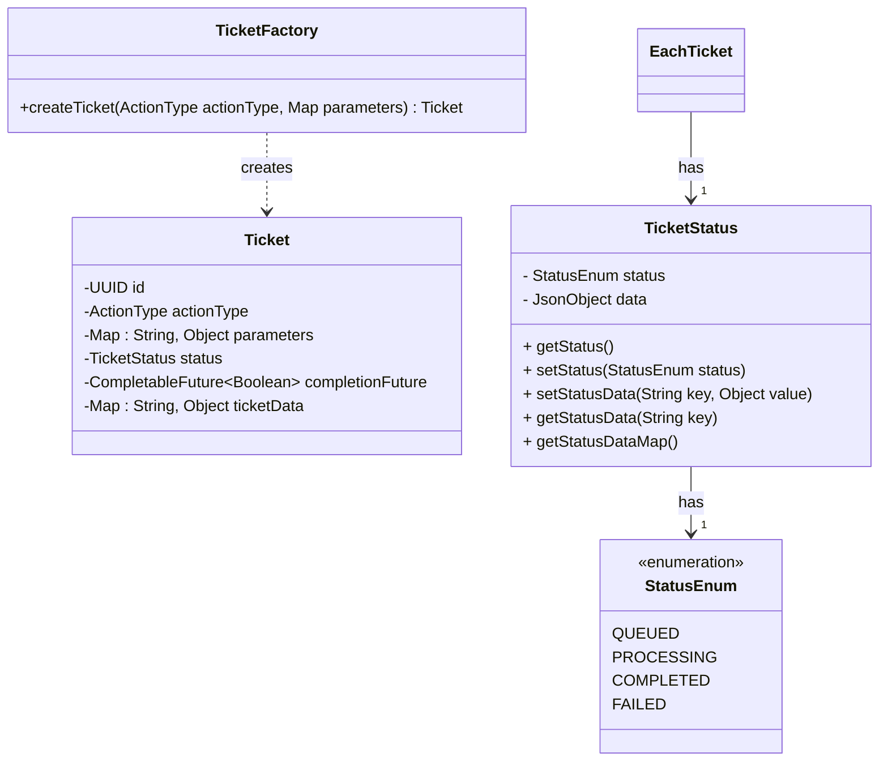
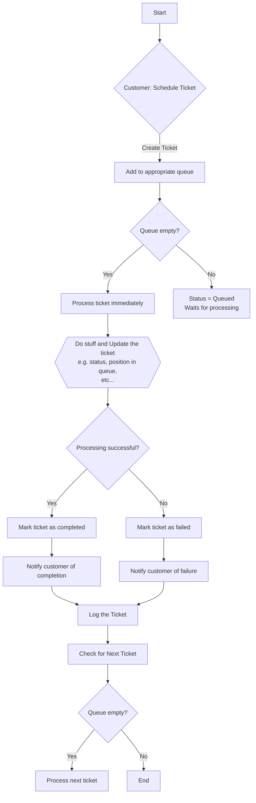
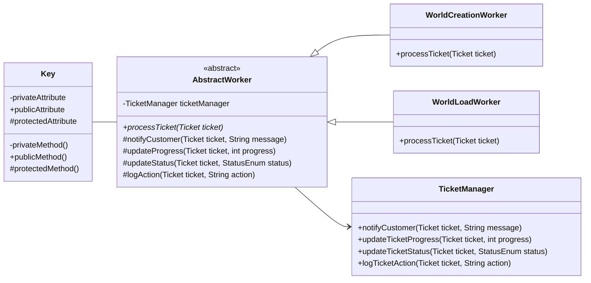
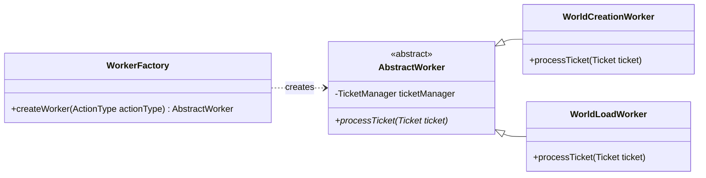
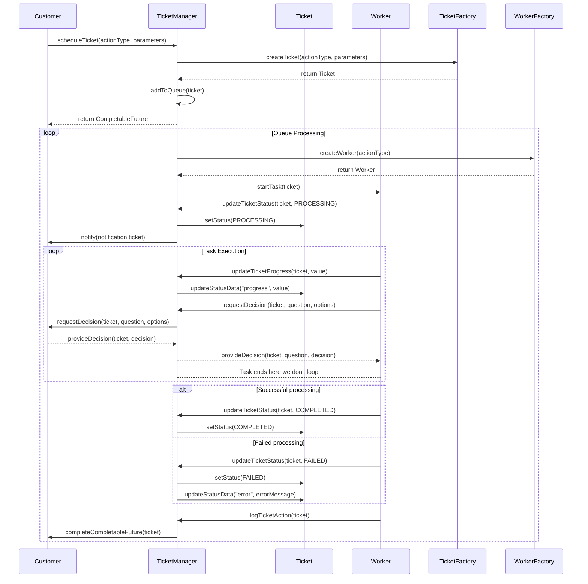

# One at a time please
> This system is being designed to be used in a minecraft plugin for on demand encapsulated worlds

> Currently we use a ticket system to queue world management actions such as create and load. This is effective to ensure that we minimize concurrent world management which may cause world corruption. We are looking to improve this system to allow all "dangerous" plugin actions to be run in queues to allow for more control over the action processes and easy implementation of safety mesures

    Later implementation could allow for multiple workers running in parellel via abusing region threads (Folia) or running in concurrency on the same thread with robust world saftey measures

----
## Ticket Manager 

> This is the queue manager that will handle scheduling of all actions and allow for communication between the:
 <strong>customer</strong>(code that scheduled the ticket) and the <strong>worker</strong>(code the ticket executes)

## Ticket Factory

## TicketManager Logic

----
## Worker Design

## Worker Factory

## Example Ticket Sequence
<h5>
    

        Note: A Customer is just the code that scheduled the ticket. They communicate to the worker through the TicketManager
    

</h5>

>     Example worker increments an int
>  
>      1. Set ticket status to processing 
>      2. Inform customer of status change
>      3. increment the progress value
>      4. update ticket data with new value (incremented int)
>      5. request decision from the customer (eg: new stepAmount)
>      6. receive a decision (eg: +5 every time)
>      7. Sets the new step count
>      8. Complete Ticket
>   
---

